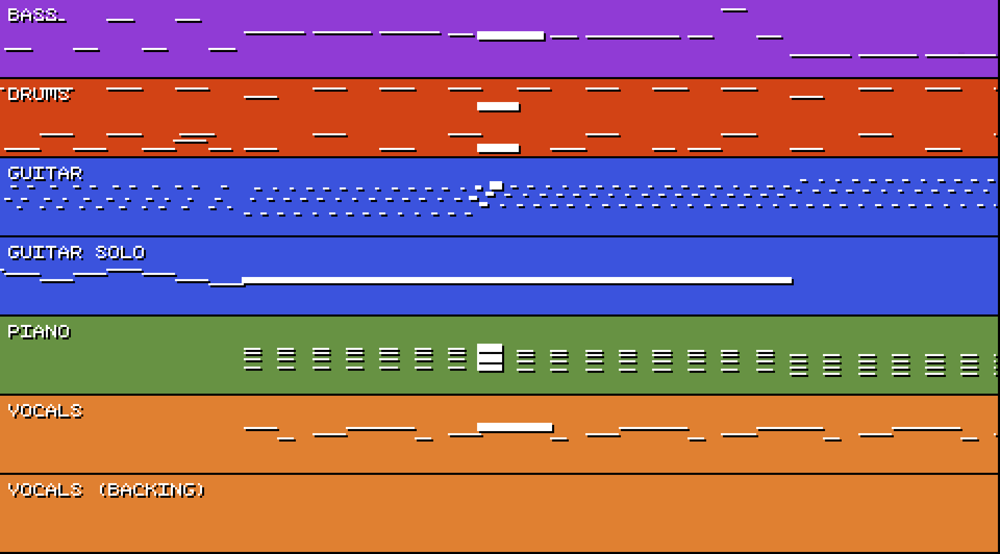

# Multitrack Visualizer

A small tool that visualizes music in two ways:

* Loading up several WAV files at once and rendering their waveforms
* Reading a MIDI file and rendering the note data

The output is an MP4 file, which you'll need to mux with the original master audio.

I plan on using this for [my YouTube channel](https://youtube.com/TomboFry),
where I upload chiptune music. I figured it would be a good visualisation tool,
and different from my usual screen capture of FL Studio.

## Screenshots

I've uploaded [a full-song to YouTube using this software](https://www.youtube.com/watch?v=9mGbqnYR_UI), so you can see what the final output looks like!

### Waveform Output


### MIDI Output



## Usage

```
multitrack-visualizer.exe [OPTIONS]

Either a song or midi JSON config file MUST be provided, along with the window config.

Options:
  -s, --song /path/to/song.json       JSON config file for all tracks, colours, and audio files (no default)
  -m, --midi /path/to/midi.json       JSON config file for MIDI file visualization (no default)
  -w, --window /path/to/window.json   JSON config file for size and scaling of the output video (default: ./window.json)
  -p, --window-preset                 Preset window options: "16x9" (1920x1080), "9x16" (1080x1920), "9x18" (1080x2160)
  -h, --help                          Print this help
  -V, --version                       Print version
```

## JSON Config Format

### Song.json

* `channels`, an array of objects, where:
  * `name` is the channel name, displayed on screen
  * `file` is a path name to the audio file, and
  * `colour` (optional) - contains the Red, Green, and Blue colour values
    (0-255). Defaults to black, ie. `[0, 0, 0]`
  * `use_alignment`: (optional) - Attempt to align the waveform on each frame.
    Non-tonal channels or low frequency audio might look better displayed when
    this is turned off. Defaults to `true`
* `video_file_out` is a path name to the video file that will be output.
* `use_gradients` (optional) - each channel's background can display a colour that subtly fades from top to bottom. Defaults to `true`

```json
{
  "channels": [
    {
      "name": "Channel Name",
      "file": "/path/to/audio-file.wav",
      "colour": [0, 2, 255],
      "use_alignment": false
    }
  ],
  "video_file_out": "/path/to/output.mp4"
}
```

### Midi.json

* `midi_file` is a path name to a .MID file,
* `video_file_out` is a path name to the video file that will be output.
* `use_gradients` (optional) - each channel's background can display a colour that subtly fades from top to bottom. Defaults to `true`
* `channels`, is an object, where each key is the name of a track within the MIDI file. Adding channels is optional, but will default the track to a black background and sort them in alphabetical order. Each sub-object contains the following properties:
  * `order` (optional) - a number which is zero or above, used to rearrange the channels that appear on screen
  * `visible` (optional) - hides the channel from the screen, if the MIDI contains extra channels you don't want to appear.
  * `colour` (optional) - contains the Red, Green, and Blue colour values (0 - 255). Defaults to black, ie. `[0, 0, 0]`

```json
{
  "midi_file": "/path/to/song.mid",
  "duration_secs": 3,
  "video_file_out": "/path/to/output.mp4",
  "use_gradients": true,
  "channels": {
    "Piano": {
      "colour": [ 107, 163, 66 ],
      "order": 1
    },
    "Guitar": {
      "colour": [ 55, 74, 228 ],
      "order": 0
    },
    "SFX": {
      "visible": false
    }
  }
}
```

### Window.json

* `width` and `height` are the base resolution for the video file.
* `scale` is how many times the resolution should be scaled (integer).
  * For example, the default is 480x270 at a scale of 4, which means the final
    output resolution is 1920x1080.
* `frame_rate` the frame rate of the output video
* `duration_secs` (optional) Changes how much of the song to display on-screen at
  once, in seconds. Only used for MIDI renders. Defaults to `5.0`

```json
{
  "width": 480,
  "height": 270,
  "scale": 4,
  "frame_rate": 30,
  "duration_secs": 5
}
```
