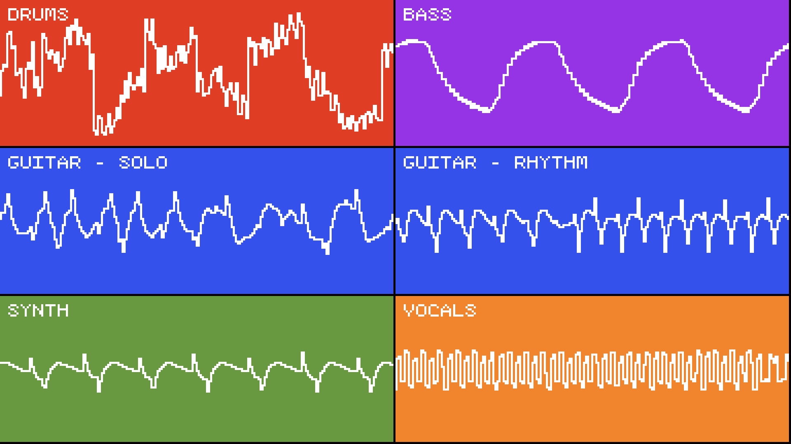

# Multitrack Visualizer

A small tool that loads multiple audio files at once and simultaneously renders
each of their waveforms to PNG.

I plan on using this for [my YouTube channel](https://youtube.com/TomboFry),
where I upload chiptune music. I figured it would be a good visualisation tool,
and different from my usual screen capture of FL Studio.

## Screenshot

## Planned Features

* [x] Load multiple audio tracks
* [x] Render waveforms to screen
* [x] Load dynamically from JSON
* [x] Specify colours and titles for each track
* [x] Change display size via config
* [x] Render individual frames to PNG
* [x] Handle errors properly!!!
* [x] Change columns depending on aspect ratio (eg. for vertical video)
* [ ] Render entire sequence to MP4
